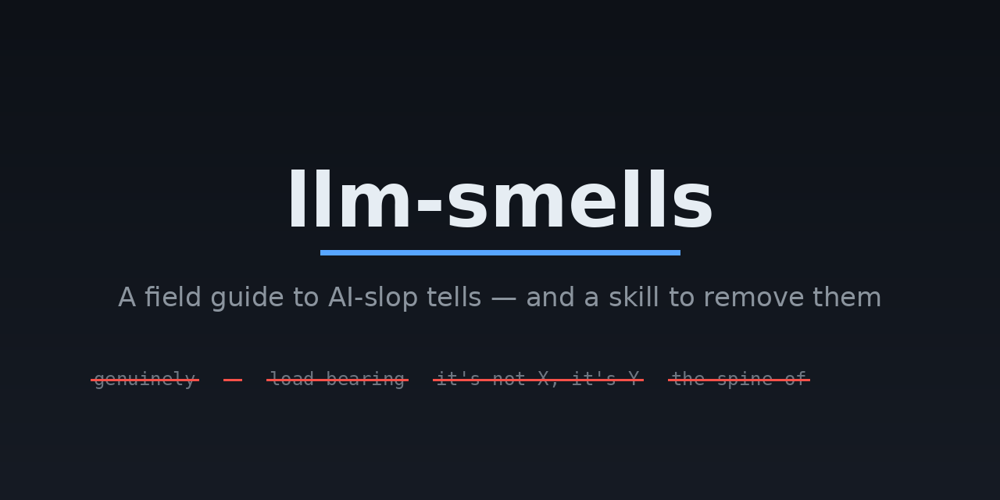

# llm-smells

A field guide to "LLM smells" — the recognizable tells of AI-generated text — plus a
reusable agent **skill** that detects and removes them.

Compiled from the blog post [*Various LLM smells*](https://shvbsle.in/various-llm-smells/)
by Shiv and the accompanying [Hacker News thread](https://news.ycombinator.com/item?id=48313810)
(287 comments).

## What's here

| Path | What it is |
|------|------------|
| [`SKILL.md`](SKILL.md) | A self-contained agent skill. Point your AI agent at it when generating or reviewing text; it drafts, audits against the checklists, and rewrites to remove the smells. |
| [`archived/LLM_SMELLS_DIRECTORY.md`](archived/LLM_SMELLS_DIRECTORY.md) | The exhaustive directory of smells (writing, code, design, image, behavioral) with examples and sources. |
| [`archived/hn_comments_raw.json`](archived/hn_comments_raw.json) | All 287 raw HN comments used as source material. |
| [`archived/images/`](archived/images) | The original screenshots from the blog post (fonts, buttons, cards, badges). |

## Using the skill

The skill is designed for two situations:

1. **Generating text** — prose, docs, emails, posts, READMEs, commit messages, copy.
2. **Reviewing a document** — auditing existing text and reporting fixes.

Its workflow: **draft → audit against every checklist → rewrite (don't patch) →
verify → report**. It covers banned words/phrases, sentence-structure patterns,
tone, punctuation, document formatting, code comments, and visual/UI defaults.

Drop `SKILL.md` into your agent's skills directory (or paste it into your system
prompt / project rules), then instruct the agent to apply it before returning text.

## Installation

### Claude Code

```bash
mkdir -p ~/.claude/skills/llm-smells
git clone https://github.com/shitijkarsolia/llm-smells.git /tmp/llm-smells
cp /tmp/llm-smells/SKILL.md ~/.claude/skills/llm-smells/
```

### OpenCode

```bash
mkdir -p ~/.config/opencode/skills/llm-smells
cp SKILL.md ~/.config/opencode/skills/llm-smells/
```

> OpenCode also scans `~/.claude/skills/`, so a single copy into `~/.claude/skills/llm-smells/` works for both.

### Any other agent

Paste the contents of `SKILL.md` into your system prompt, project rules, or
agent instructions.

## Usage

Once installed, invoke it before the agent returns text:

```
Apply the llm-smells skill, then write a launch announcement for our API.
```

Or to review an existing document:

```
Apply the llm-smells skill to review and report smells in README.md.
```

You can also direct the agent generically: "de-slop this text: [paste text]".

## Categories of smells covered

- **Writing/prose** — contrastive negation ("it's not X, it's Y"), jab-jab-thrust
  triples, manufactured punchlines, em-dashes, the genuine/honest/actual cluster,
  "load bearing", "the spine of", and many more.
- **Code** — verbose obvious comments, whitespace bloat, bespoke-everything.
- **Visual/web** — JetBrains Mono by default, purple gradients, generic card grids,
  blinking-dot badges.
- **Image** — uniform over-detail, no focal hierarchy, inconsistent perspective.
- **Behavioral** — sycophancy, "happy to help", "you're absolutely right".

See the [full directory](archived/LLM_SMELLS_DIRECTORY.md) for the complete list with
examples, sources, and per-model tells.

## Related projects

- [blader/humanizer](https://github.com/blader/humanizer) — a prose-focused skill that
  removes signs of AI writing, based on Wikipedia's "Signs of AI writing". Great
  complement: it goes deep on prose with before/after examples and voice calibration,
  while this repo covers a broader set of domains (code, web/UI, image, behavioral).

## Credit

All observations are credited to the original blog author and HN commenters in the
directory file. This repo organizes their work into a usable tool.

## License

[MIT](LICENSE)
