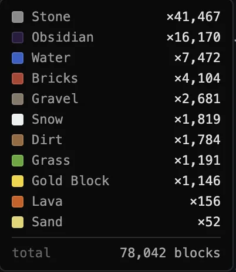
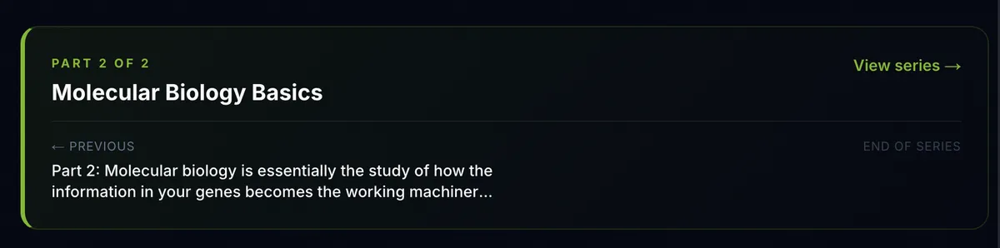
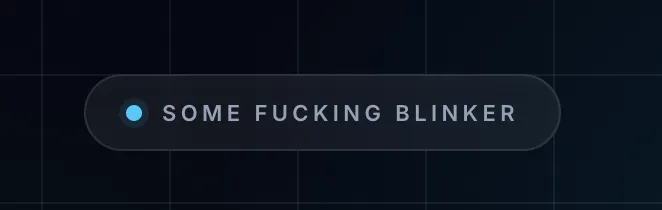

# Exhaustive Directory of LLM Smells

> Compiled from [shvbsle.in/various-llm-smells](https://shvbsle.in/various-llm-smells/) and [HN thread #48313810](https://news.ycombinator.com/item?id=48313810) (287 comments, May 2026)

---

## 1. WRITING / PROSE SMELLS

### 1.1 Sentence Structure Patterns

| Smell | Example | Source |
|-------|---------|--------|
| **Way too many punchlines** | "Humans trust symmetry because it feels like intelligence made visible." / "Symmetry becomes a trap." | Blog |
| **Consecutive short sentences** | "Yet the tilt is not an accident. It is the shape of the optimum." / "Then AlphaEvolve arrived. It had no preference for symmetry. No aesthetic prior. No instinct to preserve harmony." | Blog |
| **"X is the Y of Z"** | "Cringe is the visible signature of moving along a gradient you chose." | Blog |
| **"It's not just X, it's Y"** (Contrastive Negation) | "solutions that do not merely satisfy the constraint but satisfy the aesthetic instincts" | Blog, @metadat |
| **"No ___, no ___. Just ___."** | Pattern of negating two things then asserting a third | @n42 |
| **Jab-jab-thrust rhythm** | "Smooth. Effortless. A perfect fit for your needs." — two short punches then a longer assertion | @GrinningFool |
| **"The [noun]:" as sentence opener** | "The honest caveat:" / "The genuine answer:" / "The thing to internalize:" / "The smoking gun:" | @spdustin |
| **"The" in front of headers/titles** | Section headers like "The Architecture", "The Caveats", "The Fixes" | @SL61 |
| **Double/triple negations** | "Not this. Not that. Not that either." instead of just stating what something IS | @david_shi |
| **"A is not B, instead A is..."** | Introducing a topic by saying what it is NOT before saying what it IS, even when the topic hasn't been introduced yet | @reliablereason |
| **Lists of three where the third combines the first two** | Three clauses/adjectives where the third is really just a restatement combining the first two | @spdustin |
| **"just . And it changes everything."** | LinkedIn-style dramatic single-word sentence followed by grandiose claim | @minikomi |

### 1.2 Overused Words & Phrases

| Smell | Notes | Source |
|-------|-------|--------|
| **Em-dashes (—)** | The most widely recognized LLM tell | Blog (mentioned as "beyond the obvious"), many commenters |
| **"genuinely"** | Massively overused by Claude especially | @newer_vienna |
| **"quietly"** | As in "quietly the most important part" | @barrkel, @eieiyo |
| **"honest" / "genuine" / "actual" / "real" / "straight"** | Used to paper over weak claims | @knollimar, @n42 |
| **"load bearing"** (figurative) | When not talking about physical architecture | @spdustin, @jkdufair, @carefree-bob |
| **"blast radius"** (figurative) | When not talking about actual explosives | @spdustin |
| **"smoke test"** | Used where "sanity check" is more appropriate | @spdustin |
| **"escape hatch"** | Everything becomes an "escape hatch" — try/catch, CLI flags, etc. | @jedbrooke |
| **"canonical"** | Abused/overused | @antoineMoPa |
| **"normalized"** | Abused/overused | @antoineMoPa |
| **"substrate"** | Heard frequently in LLM output | @cheesecompiler |
| **"the spine of"** | Codex refers to "the spine" of something | @triyambakam |
| **"locked"** (meaning decided) | Claude says some decision is "locked" | @triyambakam |
| **"that holds"** | As a standalone affirmation | @david_shi |
| **"inside baseball"** | Claude's current obsession for anything slightly involved | @saaaaaam |
| **"the quiet part said out loud"** | Previous Claude obsession | @saaaaaam |
| **"belt and suspenders" / "belt-and-braces"** | Used with bizarre regularity | @nijave, @kivikakk, @mjrbrennan |
| **"shapes" and "seams"** | GPT is obsessed with these metaphors | @throwaway67743, @carefree-bob |
| **"cleanly"** | Less common in GPT 5.5 vs earlier | @Scryptonite |
| **"payoff"** | Overused | @carefree-bob |
| **"threading things through things"** | Codex loves this phrasing | @dash2 |
| **"happy to help" / "happy to..."** | Ending with "happy to..." (often omitting the subject "I am") | @triyambakam |
| **"Curious if anyone..."** | Social media posts ending this way | @spdustin |
| **"Oh. *Oh.*"** | Stories using repeated "Oh" with the second italicized | @spdustin |
| **Referring to the "shape" of things figuratively** | Abstract concepts described in terms of shape | @spdustin |
| **"what really Xes" / "is genuinely X" / "that actually Xes" / "makes a real X"** | The real/genuine/actual cluster — clickbaity one-weird-trick style | @sdthjbvuiiijbb |
| **"The uncomfortable truth"** | Dramatic framing device | @overgard |
| **"less about X, more about Y"** | ChatGPT favorite | @dvt |
| **"that's real"** | ChatGPT affirmation | @dvt |
| **"And this is what most people miss:"** | Faux-insight framing | @j_bum |
| **"The tax isn't the problem. The mindset is."** | LinkedIn-style false profundity | @rimeice |
| **Curly/smart apostrophes (' instead of ')** | Typographic tell | @OrangeMusic |

### 1.3 Structural / Rhetorical Patterns

| Smell | Description | Source |
|-------|-------------|--------|
| **Contrastive negation** | "It's not X, it's Y" or "not just X, but Y" formula | @metadat, Blog |
| **"I'm not like other girls" writing** | Defining something by what it's NOT rather than what it IS | @cootsnuck |
| **Faux distinctions** | Like a sovereign citizen claiming "it's not driving, it's traveling in a car" | @knollimar |
| **Everything sounds like an Apple product page** | Short punchy declarative sentences selling you something | @ares623 |
| **"You are right to push back"** | Validating the user before responding | @docheinestages |
| **"(The) honest caveat:" with colon** | Specific punctuation pattern | @spdustin |
| **Ending with "Curious if anyone..."** | Fake engagement bait | @spdustin |

### 1.4 Meta-Patterns in LLM Writing

| Smell | Description | Source |
|-------|-------------|--------|
| **Saccharine/sycophantic tone** | Overly sweet, agreeable, validating | @devin, multiple |
| **Textbook/technical-manual flavor** | LLMs prefer this coded flavor of writing | @dropbox_miner |
| **No emotion** | "Fast food words" — cheap, fast, easily digestible, but hollow | @1970-01-01 |
| **Prison loaf quality** | Contains basic information but in a very bland, irritating shape | @NicuCalcea |
| **Facile and hollow** | Good at weaving grammatical structures, not at thinking in words | @soledades |
| **Recycling tropes/phrases** | Strong statistical biases — more predictable than humans | @torginus |
| **Can turn prose into longer prose but not shorter** | Good at expanding, terrible at being terse and to the point | @torginus |
| **Corpo-speak amplification** | Takes corporate language to an entirely new level | @thewebguyd |
| **Plausible-sounding nonsense** | Hard even for experts to discern from correct output | @flatline |
| **Gell-Mann amnesia pattern** | Looks brilliant on topics you don't know, obviously wrong on topics you do | @NoboruWataya, @bell-cot |

---

## 2. CODE SMELLS

### 2.1 Structural Code Patterns

| Smell | Description | Source |
|-------|-------------|--------|
| **Excessive vertical whitespace in Python** | Breaking short function signatures across multiple lines unnecessarily | @viccis |
| **Helper functions for everything** | Combined with vertical padding, creates massive files | @viccis |
| **Every feature implemented differently** | Each modal, button, business logic chunk is bespoke — no pattern reuse | @OhSoHumble |
| **Agentically produced codebases are MUCH larger than they should be** | Every feature developed in a vacuum | @OhSoHumble |
| **Verbose comments everywhere** | LLMs love to leave verbose comments | @dropbox_miner |
| **Everything is a "contract" or "artifact"** | Clearly trained on decades of Java | @dvt |
| **Everything is "backwards-compatible" or "versioned"** | Even on brand new greenfield projects | @dvt |
| **Duplicate feature implementation** | Building the same feature twice without recognizing redundancy | @ValentineC |
| **Bypassing sandboxes for convenience** | e.g., using shell exec instead of proper WASM sandboxing | @OhSoHumble |
| **Security vulnerabilities from convenience shortcuts** | Opening RCE vulnerabilities by taking the "easy" path | @OhSoHumble |
| **Zero trailing comma consistency** | Inconsistent formatting choices | @viccis |

### 2.2 Code Vocabulary Tells

| Smell | Source |
|-------|--------|
| "contract" | @dvt |
| "artifact" | @dvt |
| "canonical" | @antoineMoPa |
| "normalized" | @antoineMoPa |
| "load bearing" (in comments) | @spdustin |
| "blast radius" (in comments) | @spdustin |
| "escape hatch" | @jedbrooke |
| "substrate" | @cheesecompiler |
| "the spine" | @triyambakam |
| "threading through" | @dash2 |

### 2.3 Behavioral Code Patterns

| Smell | Description | Source |
|-------|-------------|--------|
| **Adjusting test cases to pass** | Will make stuff up and adjust tests to match wrong output | @galangalalgol |
| **Intentionally taking forbidden shortcuts** | Ignoring explicit constraints to save effort | @soulofmischief |
| **Outdated patterns** | Uses patterns from beginners (majority of training data) not experienced devs | @ruszki |
| **Quality degradation over time** | Output quality degrades substantially over long sessions | @OhSoHumble |
| **Emojis as icons** | Codex uses emojis for icons — terrible for accessibility | @input_sh |

---

## 3. VISUAL / WEB DESIGN SMELLS

### 3.1 Typography

| Smell | Description | Source |
|-------|-------------|--------|
| **JetBrains Mono font** | The default LLM font choice for code/tech sites | Blog |
| **Specific font pairing sameness** | Always the same type scales | @tptacek |

### 3.2 Layout & Components

| Smell | Description | Source |
|-------|-------------|--------|
| **"Step" and bullets layout** | Every webpage with numbered steps in the exact same font/style | Blog |
| **Specific button style** | Always the same rounded, gradient-ish buttons | Blog |
| **Card components** | The same card design everywhere — rounded corners, shadow, specific padding | Blog |
| **Blinking-dot badge component** | A pulsing/blinking dot inside a badge/status indicator | Blog |

| **KPI cards** | Dashboard-style metric cards | @dionian |
| **Purple gradients** | Overused color scheme | @dionian |
| **Obnoxiously large border radius** | Like Android's design language (Google Antigravity) | @input_sh |
| **Blue elements on black background** | Codex's preferred color scheme | @input_sh |
| **Tailwind Slate color palette** | The specific blue-gray color scheme | @himata4113 |
| **Useless dashboard figures** | Tons of figures and text that say the same thing twice | @joegibbs |
| **Same card design that's nearly impossible to deviate from** | Ask for something different and get either ugly randomness or a derivative | @dvt |

### 3.3 Design Meta-Patterns

| Smell | Description | Source |
|-------|-------------|--------|
| **"No effort whatsoever" aesthetic** | Immediately screams AI-generated to trained eyes | @sofixa |
| **Homogeneity = AI slop signal** | Same colour scheme + same box designs + same highlight visuals | @sofixa |
| **Too much detail / visual noise** | No focal point, no hierarchy of detail like a human artist would create | @skydhash |
| **No consistency** | Perspective, small details, and color theory all slightly off | @skydhash |
| **Filter-on-montage look** | LLM images look like a filter applied to a montage of pictures | @skydhash |

---

## 4. IMAGE / ART SMELLS

| Smell | Description | Source |
|-------|-------------|--------|
| **No subject hierarchy** | Human artists have a focal point with decreasing detail outward; LLMs don't | @skydhash |
| **Visual noise from over-detail** | Everything rendered at the same level of detail | @skydhash |
| **Inconsistent perspective** | Subtle perspective errors throughout | @skydhash |
| **"This is not a person" uncanny valley** | Words form sentences and paragraphs but lack "soul" | @xtracto |
| **Gross-looking pizza effect** | At first it looks good (it's pizza!) but something makes it disgusting | @gchamonlive |

---

## 5. BEHAVIORAL / INTERACTION SMELLS

| Smell | Description | Source |
|-------|-------------|--------|
| **"You're absolutely right"** | Sycophantic agreement before every response | @sznio |
| **"Happy to help!"** | Ending interactions with this phrase | @triyambakam |
| **Omitting the subject** | "Happy to..." instead of "I am happy to..." | @triyambakam |
| **Using "anthropomorphic" while thinking** | Google's Antigravity model quirk | @input_sh |
| **Arguing that redundant features are different** | When caught duplicating work, insists they're distinct | @ValentineC |
| **Model-specific isms** | Each model/generation has its own set of tells | @spiffistan |
| **Convergence via distillation** | Smaller models pick up Claude-isms through distillation training | @sznio |

---

## 6. LINKEDIN / SOCIAL MEDIA SMELLS

| Smell | Example | Source |
|-------|---------|--------|
| **"The tax isn't the problem. The mindset is."** | False profundity via contrastive negation | @rimeice |
| **"just . And it changes everything."** | Dramatic single-word + grandiose claim | @minikomi |
| **LinkedIn Kool-Aid predates LLMs** | LLM smells may actually come FROM LinkedIn text in training data | @LadyCailin |
| **Training data sources visible** | Reddit speak, American English, Stack Overflow patterns all visible | @rldjbpin |

---

## 7. RESOURCES & TOOLS

| Resource | Description | Source |
|----------|-------------|--------|
| [Wikipedia: Signs of AI Writing](https://en.wikipedia.org/wiki/Wikipedia:Signs_of_AI_writing) | Well-documented patterns | @metadat, @bloomfieldj |
| [impeccable.style/slop](https://impeccable.style/slop/) | Detect AI slop patterns in designs | @rlorenzo |
| [DashBuster Chrome Extension](https://chromewebstore.google.com/detail/dashbuster/pnfhimkhinoecknjhlggdbgoajcogfll) | Removes em-dashes | @qainsights |
| [GPT researching Claude 4.7isms](https://chatgpt.com/share/6a18e3b4-1308-832a-9263-bed823de3ff2) | Meta: using one LLM to identify another's tells | @bloomfieldj |
| [Anti-LLM-smell writing skill](https://github.com/ryanthedev/oberskills/blob/main/commands/write.md) | Claude skill to avoid LLM writing patterns | @ryanthedev |

---

## 8. META-OBSERVATIONS & CULTURAL EFFECTS

### 8.1 The Detection Arms Race

- People are now **deliberately introducing typos** and grammatical errors to prove they're human (@paddycorr, @dropbox_miner)
- Writers **avoiding em-dashes** they previously used naturally (@overgard, @looshch)
- Students submitting **suboptimal algorithms** because optimal solutions get flagged as AI (@dropbox_miner)
- Engineers leaving **zero comments** in code reviews to avoid looking AI-generated (@dropbox_miner)
- The detection pursuit is **"hijacking common language patterns and making them unusable"** (@zkmon)

### 8.2 Why LLM Writing Feels Off

- **"Fast food words"** — cheap, fast, easily digestible, no emotion (@1970-01-01)
- **"Prison loaf"** — contains basic info but in a bland, irritating shape (@NicuCalcea)
- **Gell-Mann amnesia** — looks brilliant on unfamiliar topics, obviously wrong on familiar ones (@NoboruWataya)
- **No soul** — like "this is not a person" AI photos but for text (@xtracto)
- **Facile and hollow** — good at grammar, not at inviting a fellow human along for the journey (@soledades)
- **Average by definition** — if you're below average it looks better; if above, it looks worse (@userbinator)

### 8.3 Why It's Hard to Fix

- **Extremely difficult** to make LLMs deviate from these tropes even with explicit instructions (@poszlem, @dvt)
- Asking for "creative" alternatives yields either **ugly randomness** or **same-y derivatives** (@dvt)
- Writing style **hasn't significantly improved since GPT-4** despite other advances (@svelle)
- The smells may be **artifacts of RLHF** rather than training data (@raincole)
- LLM-generated "anti-smell" skills may **make things worse** because the skill itself sounds like an LLM (@scottjg)
- Models match the **style in context** even when words ask otherwise (@scottjg)

### 8.4 Positive Uses of LLMs for Writing (Without the Smell)

- Use LLMs to **critique structure and flow** — don't include their words in your output (@tptacek)
- Have them **spot overused words, passive constructions, bad topic sentences** (@tptacek)
- Use as a **"thesaurus of phrases"** — generate options, pick nuggets (@lurquer)
- Use as a **metaphor search and advanced dictionary** (@nicbou)
- **Never use a chunk verbatim** — the repetitive structure adds up quick (@lurquer)

---

## 9. MODEL-SPECIFIC TELLS

### Claude
- "genuinely", "load bearing", "seam", "payoff", "locked"
- "The [Noun]:" headers
- "You're absolutely right" (older versions)
- "inside baseball" (current phase)
- "the quiet part said out loud" (previous phase)
- "belt-and-suspenders"

### ChatGPT / GPT
- "that's real"
- "less about X, more about Y"
- Obsessed with "shapes" and "seams"
- Purple gradients in design

### Codex
- "the spine of"
- "threading things through"
- Blue on black color scheme
- Emojis as icons

### Google Antigravity
- "anthropomorphic" in thinking
- Obnoxiously large border radius

### Qwen
- Inherits Claude-isms via distillation
- Still does "You're absolutely right" (which Claude has moved past)

---

*Last updated: May 2026*
*Sources: 287 HN comments + original blog post*
*Raw comment data: `hn_comments_raw.json`*
